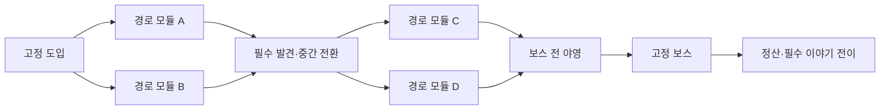

# 스테이지 내부 경로의 모듈화 초안

작성: 2026-10-05. 코드·확률·완성 지도는 아니다. 목표는 **이야기의 필수 사건은 유지하면서 이동 경로·만나는 사람·전투 조합·선택의 후속 결과가 달라지는 원정**이다.

## 1. 세 단계로 나누는 구성

| 계층 | 고정 또는 변화하는 것 | 예시 |
| --- | --- | --- |
| 스테이지 설계 | 세계·목표·필수 장면·합류·보스·끝의 이야기 전이 | 3스테이지 원소탑, 리엔 발견, 흡수 장치 중단 |
| 경로 모듈 | 작은 갈림길·2~4개 방·상황·입구/출구·이어질 사건 | 배수로 침투, 연구동 조사, 마력 승강기 돌파 |
| 방 내용 | 현재 조건에 맞는 적 조합·이벤트 변형·대화 | 같은 연구동이라도 살아 있는 증인 또는 버려진 기록 |

방을 무작위로 늘어놓는 것만으로 반복감이 해결되지는 않는다. 모듈마다 “왜 이 길로 가는지”와 끝에서 무엇이 달라지는지를 둔다. 전투 횟수와 방의 순서뿐 아니라 상황과 인물의 기억이 변해야 한다.

모듈은 원정의 경로 단위이고, 이벤트 체인은 여러 스테이지에 걸친 이야기 단위다. 하나의 모듈에 체인 전부를 넣지 않는다. 원소탑 모듈에서 EV05를 시작하고 뒤의 협곡·빙원·마왕성에서 이어갈 수 있다.

## 2. 한 스테이지의 기본 뼈대

각 모듈 내부에는 추가 작은 분기와 합류가 있을 수 있다. 같은 구간에서 A와 B를 모두 돌아 보상을 챙기는 구조는 기본안에서 제외한다. 선택한 다음 방만 진행하고 지나간 갈래는 잠긴다. 앞으로의 경로를 보여 주며, 조건을 충족한 정보만 정찰로 공개한다.

일반 스테이지의 실제 선택 경로는8~12개 방, 후보 지도는 약14~24개 노드를 첫 시안으로 한다. 1스테이지는6~8개 방으로 더 짧게 구성하는 안이다. 필수 전투·장면·야영·보스가 들어갈 자리를 먼저 잡고 길이를 맞춘다. 방 수는 아직 게임 규칙 확정값이 아니다.

## 3. 모듈 기획 카드

| 항목 | 적을 내용 |
| --- | --- |
| 정체성 | 안정된 ID, 이름, 지역/세계, 상황과 작은 목표 |
| 입구/출구 | 어느 시점에 연결되는지, 앞뒤 모듈과 호환되는 맥락 |
| 내부 구조 | 방의 수와 연결, 갈림길·합류, 순환 없음 |
| 등장 조건 | 스테이지 범위, 본편 장면 전/후, 동료 합류·생존, NPC 상태 |
| 내용 자리 | 전투·이벤트·휴식·관찰·필수 발견의 후보와 제한 |
| 상황 갈래 | 진입 전 정보와 내부 선택에 따른 기록/증인/대피 결과 |
| 전투 성격 | 다단 공격·차지·방어·소환 등 현재 구현된 패턴과 적 상한 |
| 연결 사건 | 이 모듈에서 시작/진행할 이벤트와 다음 유효 지역 |
| 난도·길이 | 예상 전투 수·연속 위험·대화 길이·회복 접근성 |
| 반복 제약 | 같은 원정에서 재사용 금지, 같은 의미의 모듈 연속 배치 제한 |
| 미래 확장 | 추후 상점·소모품·유물·강화 자리를 둘 수 있는 위치 |

미래 확장 자리는 첫 경로 생성의 필수 조건으로 삼지 않는다. 아이템이 없어서 열 수 없는 기본 경로를 만들지 않는다. 아직 붙이지 않은 기능을 지도에서 작동하는 방으로 표시하지 않는다.

## 4. 주요 모듈 유형

| 유형 | 작은 목표와 경로 느낌 | 초기 구현에 필요한 범위 |
| --- | --- | --- |
| 침투 | 경비가 적은 길을 찾고 짧게 돌파 | 전투·분기·발견 |
| 조사 | 기록과 증언을 연결해 다른 길의 정보를 얻음 | 사건·선택·정보 공개 |
| 구조 | 이동이 어려운 사람을 안전지대로 안내 | 이야기 선택·연결 경로·대화 |
| 정면 돌파 | 더 많은 전투를 감수하고 확실한 길로 전진 | 기본 전투·예고·후속 장면 |
| 위험 관측 | 오염·붕괴 흔적을 읽고 다음 구간을 예상 | 상태 설명·정찰·정보 기록 |
| 야영·교류 | 긴장을 낮추고 관계·약속을 남김 | 안전 방·기본 회복·대화 |
| 추격·붕괴 | 사건의 긴박감을 짧은 방과 연결로 표현 | 순차 전투·연출; 실제 제한시간은 초기 요구 아님 |
| 거울·기억 | 지금까지의 선택을 다른 관점으로 비춤 | 선택 기록·대사 변형 |

구조 모듈이라는 이름 때문에 새 호위 전투 승리 조건을 자동 추가하지 않는다. 전투는 적 전멸 규칙을 사용하고, 구조/이송은 방의 이야기 결과로 처리하는 안이다. 시간 제한·보호 대상의 별도 체력 같은 새 규칙은 후속 검토 대상이다.

## 5. 3스테이지 원소탑의 원정 예시

고정 사항은 탑이 힘을 빼앗기고 있다는 것, 리엔을 발견하는 것, 보스를 처치하고 흡수 장치를 끊는 것, 클리어 뒤 리엔이 합류하는 것이다.

| 지점 | 원정 A — 기록을 따라가는 길 | 원정 B — 사람을 따라가는 길 |
| --- | --- | --- |
| 도입 | 탑 주변의 원소 역류 확인 | 같은 필수 도입 |
| 첫 모듈 | 배수로 흔적 → 경비 전투 → 지워진 경보 EV05 | 연구동 정문 → 경비 전투 → 부상 연구원과 EV05의 구조 갈래 |
| 필수 발견 | 리엔과 장치의 관계 확인 | 같은 필수 발견, 조사/구조 선택에 맞춘 대사 |
| 두 번째 모듈 | 관측실 → 수송표의 단서 → 봉쇄 구간 전투 | 피난 계단 → 미라의 증언 → 파손된 연결로 전투 |
| 야영 | 발견한 기록을 정리 | 구조한 사람의 설명을 듣기 |
| 보스 | 흡수 장치 감시자 | 같은 보스 정체성, 적 조합은 검토된 후보 안에서 변경 가능 |
| 완료 | 리엔 합류, 기술 증거를 기억 | 리엔 합류, 증인의 상태를 기억 |
| 뒤 지역 | 협곡에서 기록의 운송 경로를 추적 | 협곡에서 연구원의 증언을 확인 |

두 지도 모두 연결된 다음 방만 선택한다. “이벤트 배치”와 “선택 갈래”는 구분한다. EV05가 이번 지도에 선정된 후 플레이어가 그 안의 갈래를 선택하며, 지도가 먼저 플레이어의 선택을 대신 확정하지 않는다.

세 번째 원정 C는 **마력 승강기 돌파 → 리엔 발견 → 피난 계단 조사 → 야영 → 같은 보스**의 경로다. 첫 구간 전투 비중이 높고 뒤에 짧은 조사와 생활 사건을 둔다. EV05가 미선정이면 원소탑 사고의 기본 정보는 필수 발견에서 제공하고, 체인B의 추가 증거만 얻지 못한다. 새로고침으로 사건을 다시 추첨하지 않는다.

### 배수로 침투 모듈의 기획 카드 예시

| 항목 | 내용 |
| --- | --- |
| ID | TOWER-DRAIN |
| 등장 | 3스테이지, 리엔 발견 전, 기본 파티는 연묵1인 |
| 입구 | 탑 외곽에서 역류를 확인한 상태 |
| 내부 | 배수로 관찰 → 갈림길(경비 전투/붕괴 흔적 조사) → 기록실 앞에서 합류 |
| 출구 | 리엔 발견 필수 장면으로 이어짐 |
| 연결 사건 | 기록실에 EV05의 자리가 있음. 선정 여부는 별도 사건 배치에서 결정 |
| 플레이어에게 알려 줄 것 | 전투 경로는 경비가 보이고 조사 경로는 건물 파손과 기록 흔적이 보임 |
| 남기는 결과 | 경비 경로/조사 경로 선택, 발견한 정보. 사건 갈래는 EV05를 실제로 만났을 때만 확정 |
| 제한 | 아직 없는 리엔의 얼음 능력, 소모품, 유물로 길을 열도록 요구하지 않음 |
| 반복 | 이번 원정에서는 한 번만 사용. 같은 형태를 다른 지역에서 쓸 때 상황·내용·결과를 다시 기획 |

이 모듈의 방 내용이 달라져도 출구가 본편 장면과 연결된다는 계약은 유지한다. 잠긴 갈래·정찰된 정보·이미 완료한 노드는 방의 표시 상태로 구분한다.

## 6. 15스테이지의 모듈 풀 초안

각 칸은 후보 경로의 주제이며 실제 지도 정의가 아니다. 필수 본편은 상세 스토리의 장면을 따로 연결한다.

| 스테이지 | 경로 후보 주제 | 고정 연결 |
| --- | --- | --- |
| 1 | 창고 뒤길 / 잡역 통로 / 외곽 수로 / 폐쇄된 문서방 | 밀담→추격→집행관→세계 이동 |
| 2 | 행렬 야영 / 오염된 숲길 / 경계 유적 / 버려진 마을 | 이방의 생존→탑의 기록 |
| 3 | 배수로 침투 / 연구동 구조 / 관측실 조사 / 승강기 돌파 | 리엔 발견→흡수 장치→합류 |
| 4 | 번개 교량 / 수송대 추적 / 피난 행렬 / 폐관측소 | 첫 제어 융합→성역의 부상자 |
| 5 | 문밖 구조 / 성역 회랑 / 방치된 진료소 / 지하 신호로 | 세라의 선택→신성력 도난→합류 |
| 6 | 얼어붙은 기록소 / 순례길 / 거울 전당 / 빙하 관측점 | 융합 위험→두 고정점의 기록 |
| 7 | 피난 행렬 / 병참로 / 성벽 우회 / 마나 병기 통로 | 수도와 변경의 대가→왕성 진입 |
| 8 | 봉쇄 거리 / 흡수 관로 / 빈 예배당 / 왕성 자료실 | 마왕→남은 누출→공동 귀환 |
| 9 | 징세 거리 / 고향 시장 / 숨은 기록소 / 저항 연락로 | 시간 차이→연합 통치→요새 |
| 10 | 이송 지하로 / 경맥 관측소 / 묻힌 봉인실 / 주민 탈출로 | 해제 실패의 이유→교주 의식 |
| 11 | 제물 행렬 / 총단 외곽 / 의식 병참로 / 감금 구역 | 교주→첫 고정점 붕괴 |
| 12 | 옛 수련장 / 금역 기록실 / 주민 대피로 / 장문 의식로 | 장문→두 번째 붕괴→균열 |
| 13 | 대피 연결로 / 파열된 마을 / 침입군 흔적 / 임시 기록소 | 책임 인정→균열 진입 |
| 14 | 기억 회랑 / 경계 기록실 / 내측 고정점 / 동료 야영 | 봉인 원리 완성→지옥왕 |
| 15 | 침입 관문 / 역류 통로 / 무너진 왕좌길 / 마지막 보호선 | 지옥왕→봉인→후일담 |

내부 형태를 재사용해도 같은 방 이름만 바꿔 복사하지 않는다. 무림의 조사 모듈은 명부·증언, 판타지는 관측·피난, 균열은 복구·기억처럼 목표와 결과가 달라야 한다.

## 7. 조립 순서와 검증

1. 현재 스테이지의 필수 장면·보스·합류·전이를 고정한다.
2. 편성·NPC·확정된 이야기 선택을 확인하고 사용할 수 있는 모듈 후보를 고른다.
3. 방 수·전투 밀도·대화 밀도·회복 지점의 목표 범위 안에서 작은 그래프를 연결한다.
4. 이벤트가 들어갈 자리에40개 후보 중 조건에 맞는 사건을 배치한다. 진행 중인 체인·반복 억제·독립 생활 사건의 비중을 함께 고려한다.
5. 필수 정보와 보스에 도달하는 경로를 검사한다. 이벤트가 없어도 본편을 진행할 수 있어야 한다.
6. 전체 지도와 선정된 모듈·방 후보·숨긴 정보·난수 상태를 저장한다. 선택 결과는 진행할 때 따로 기록한다.

검사 대상은 보스 도달 가능성, 순환/고립 노드 없음, 필수 장면 순서, 보스 직전 야영, 막힌 갈래의 표시, 적 동시5마리, 특정 사망 동료·미획득 아이템이 필수 경로 조건이 아님, 이벤트 선행 관계, 같은 보상/사건 중복 처리 방지다.

선택적 지름길은 기록이나 정찰로 열 수 있지만 기본 진행 경로는 항상 남긴다. 동료가 쓰러졌다는 이유로 아직 생성된 지도를 다시 추첨하지 않는다. 후속 방의 대사·사용 가능한 선택만 실제 생존 상태에 맞춘다.

## 8. 반복 플레이와 저장의 관계

| 상황 | 지도·이야기 처리안 |
| --- | --- |
| 같은 원정에서 새로고침/이어하기 | 같은 지도·선정 사건·이미 확정된 선택을 복구 |
| 패배 뒤 명시적 재도전 | 새 시도로 새 경로를 생성하되 필수 본편은 유지 |
| 성공적으로 클리어한 스테이지 | 본편 결과와 후속 인물 상태를 캠페인에 확정 |
| 새 캠페인 | 새 경로·다른 선택·다른 파생 이야기를 경험 |
| 완료 지역의 반복 원정 | 이후 별도 정책 검토; 같은 본편 수장 처치를 되풀이하지 않음 |

초기 권장안은 일반/하드에서 스테이지 내부의 미확정 서사 선택을 해당 시도에 보관하고 클리어 때 캠페인에 확정하는 방식이다. 실패 후 재도전에서는 그 시도의 선택을 되감되 이전에 완료한 스테이지의 사실은 유지한다. 실패 기록과 이미 읽은 장면 기록은 별도로 남길 수 있으나 캠페인 사실로 쓰지 않는다.

하드코어의 전투 종료 영구 사망은 기존 요구이므로 스테이지 실패를 이유로 되감지 않는다. 그 모드의 나머지 선택 확정 정책은 후속 검토로 남긴다. 재도전을 시간 반복 서사로 설정하지 않는다.

## 9. 한 원정에서 기억할 상태

개념상 저장할 것은 스테이지/시도 식별, 선정 모듈과 실제 노드 연결, 현재/완료/잠김, 공개/미지/정찰, 사건별 선택과 해결 여부, NPC의 현재 상태, 체인의 진행과 뒤 지역의 연결 대기, 편성/체력/스테이지 덱, 본편 장면의 진행 위치다.

새 스테이지에서 이전 선택을 참조하되 과거 장면을 다시 발생시키지 않는다. 뒤에 붙일 아이템이나 강화는 이 구조에 보상 결과를 추가할 수 있으나 기본 경로 생성은 그 기능 없이도 성립해야 한다.

## 10. 기본 시스템부터 검토하는 순서

첫 설계 검토 대상은3스테이지의 경로 모듈3종과 이벤트 체인B다. 같은 본편을 유지하는 지도3개를 종이 설계로 비교하고, 지나간 갈래 잠김·합류 전 카드 제외·선행 사건 누락·두 선택의 후속 결과를 점검한다. 이때 카드 강화·유물·소모품은 필요 없다.

그 다음1스테이지의 짧은 도주와13스테이지의 복구 원정에 같은 구조가 맞는지 본다. 서로 다른 유형에서 기본 구조가 성립한 뒤 상점·아이템·강화·경제와 나머지 콘텐츠를 차례로 붙인다. 이번 작업에서는 어느 단계도 코드로 구현하지 않는다.
